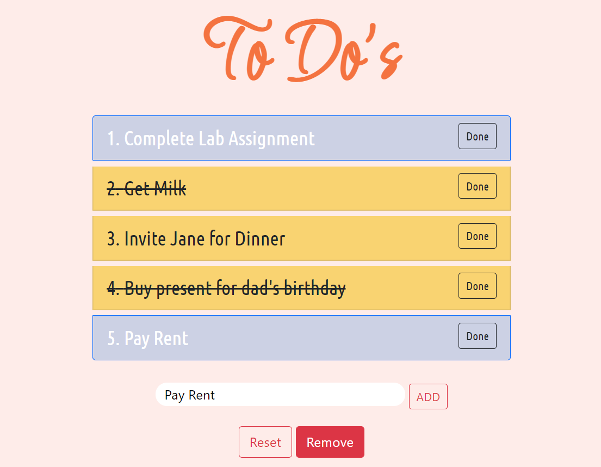

# To-Do-List

ToDo list is a simple web page to save tasks. You can delete tasks, add new tasks, clear the list and certainly check completed tasks.  
[Have a Look Here](https://200richa.github.io/To-Do-List/)

### Features
* Add new task
* Mark task as completed / uncompleted
* Delete single task
* Delete completed tasks
* Delete all tasks

### Technologies used:
* HTML
* CSS
* JavaScript
* Bootstrap

